# Installer la carte Médiathèque de Veauche, pas à pas

Ce guide part de zéro et s'arrête quand une carte affiche vos emprunts. Comptez
dix minutes, dont un redémarrage de Home Assistant.

> **Les captures viennent d'une vraie instance** de Home Assistant, pilotée par
> un script ([`scripts/screenshots/`](../scripts/screenshots/README.md)). Le
> compte « 123456789 » et les huit livres sont fictifs : ils proviennent d'un
> faux portail local, pas de la médiathèque. Votre écran montrera vos livres,
> mais les mêmes boutons aux mêmes endroits.

---

## Avant de commencer

Il vous faut :

- **Home Assistant 2026.1 ou plus récent.** Vérifiez dans
  **Paramètres → À propos**. HACS refusera l'installation en dessous.
- **Vos identifiants de la médiathèque** : le numéro de votre carte de
  bibliothèque et votre mot de passe, les mêmes que sur
  [mediatheque.veauche.fr](https://mediatheque.veauche.fr).
- **HACS installé**, si vous choisissez la méthode recommandée ci-dessous.

---

## Étape 1 — Installer l'intégration

### Avec HACS (recommandé)

HACS vous préviendra des mises à jour, ce que la copie manuelle ne fait pas.

1. Ouvrez **HACS** dans la barre latérale.
2. En haut à droite, menu **⋮** → **Dépôts personnalisés**.
3. Collez l'adresse du dépôt :
   ```
   https://github.com/Eric-D/ha-mediatheque-veauche
   ```
   Type : **Intégration**. Cliquez **Ajouter**.
4. Fermez la fenêtre, cherchez **Médiathèque de Veauche**, ouvrez la fiche et
   cliquez **Télécharger**.
5. **Redémarrez Home Assistant** : **Paramètres → Système → ⏻ → Redémarrer**.

> Ces quatre écrans ne sont pas illustrés : HACS demande une connexion GitHub
> qu'on ne peut pas automatiser sans y mettre de vrais identifiants, et le
> projet préfère n'avoir aucune capture fabriquée.

### Sans HACS

Copiez le dossier `custom_components/mediatheque_veauche/` du dépôt dans le
`custom_components/` de votre configuration, puis redémarrez. Vous devrez
répéter l'opération à chaque mise à jour.

---

## Étape 2 — Ajouter votre compte

Une fois Home Assistant redémarré, allez dans
**Paramètres → Appareils et services**.

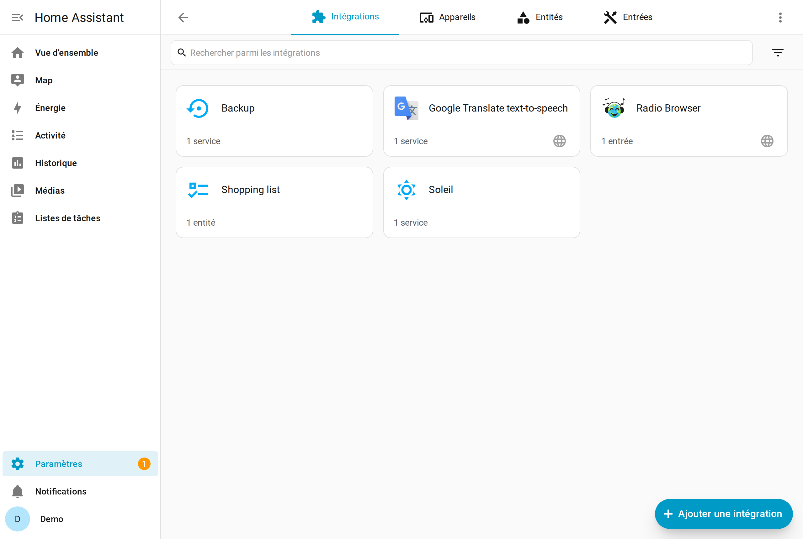

Cliquez **Ajouter une intégration**, en bas à droite, puis tapez
**médiath** dans la recherche.

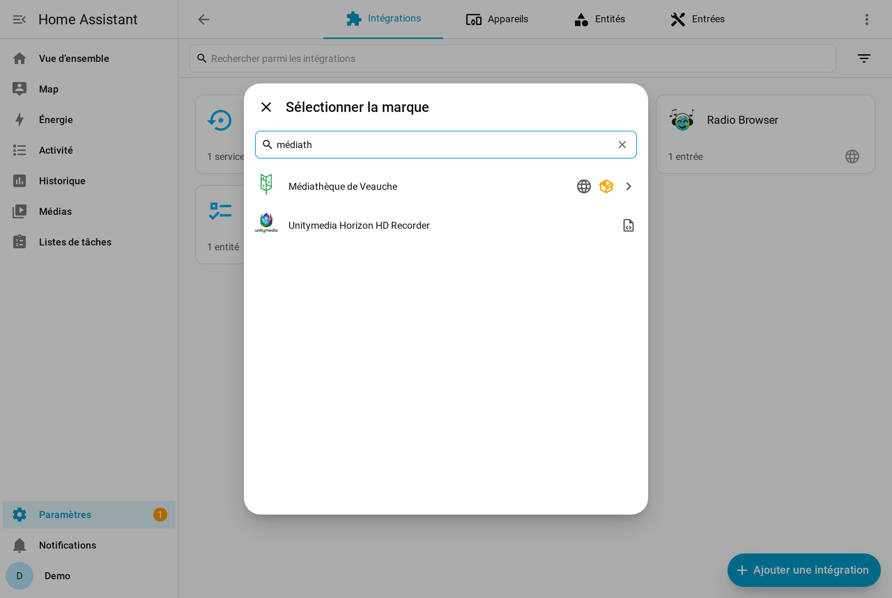

> **Rien ne sort ?** C'est que l'étape 1 n'a pas abouti, ou que le redémarrage
> n'a pas eu lieu. Redémarrez et réessayez avant de chercher plus loin.

Cliquez **Médiathèque de Veauche**. Le formulaire d'identifiants s'ouvre.

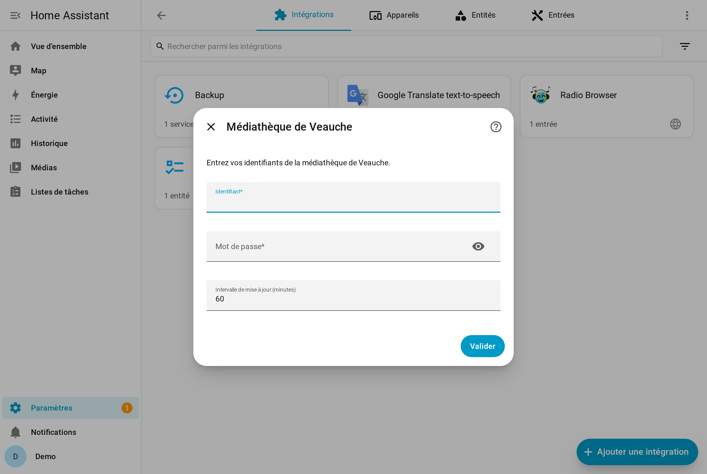

Saisissez le **numéro de votre carte** et votre **mot de passe** — ceux du site
de la médiathèque, pas ceux de Home Assistant.


Validez. Home Assistant se connecte au portail et récupère vos emprunts ; ça
prend quelques secondes. Il propose ensuite de ranger l'appareil dans une
pièce — vous pouvez **Ignorer et terminer**.

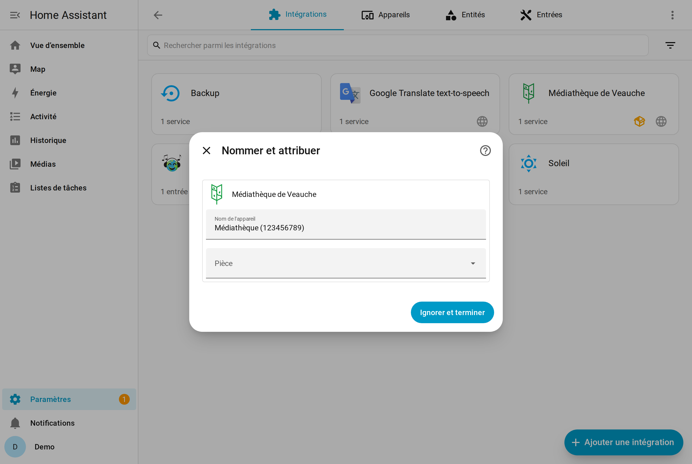

> **« Identifiants refusés »** ? Vérifiez-les sur le site de la médiathèque
> dans un navigateur. C'est le numéro de carte qui sert d'identifiant, pas une
> adresse e-mail.

L'intégration apparaît maintenant dans la liste, avec un appareil.

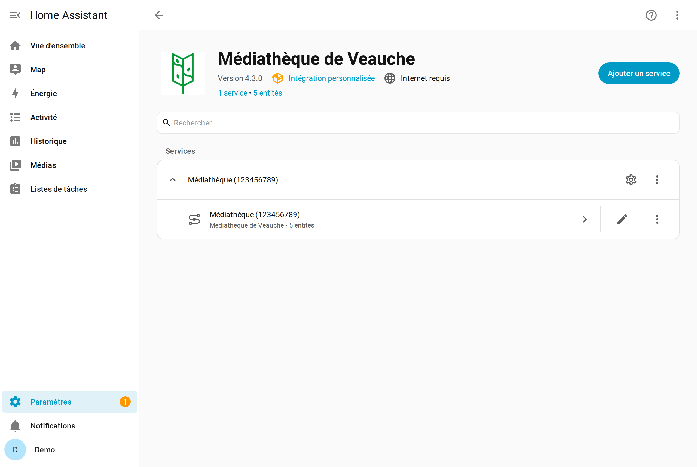

---

## Étape 3 — Vérifier les capteurs

Cinq capteurs ont été créés. Pour les voir :
**Paramètres → Appareils et services → Entités**, puis cherchez **emprunt**.

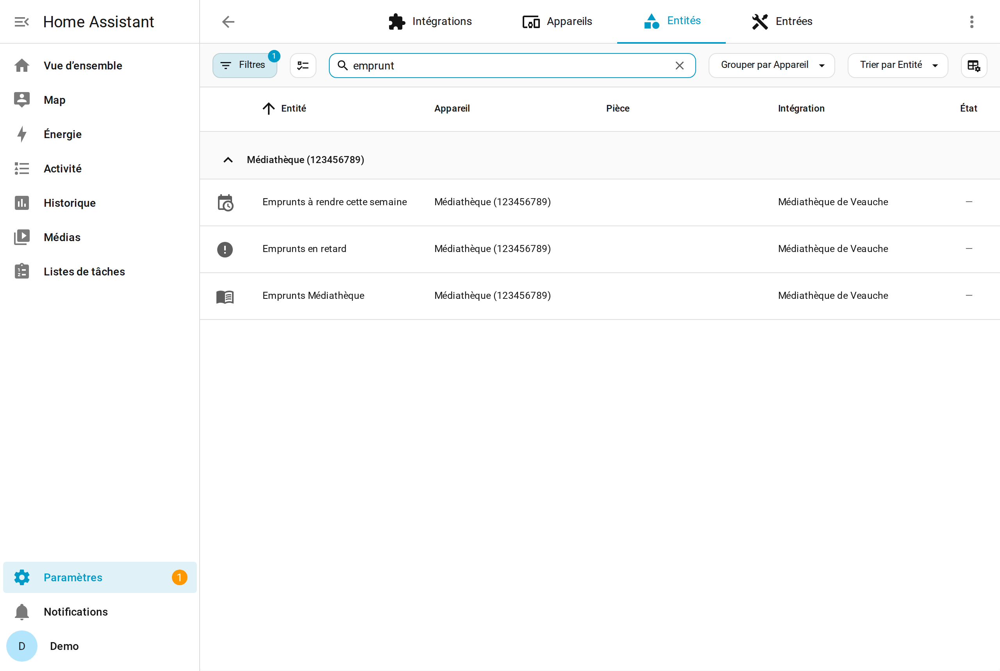

| Capteur | Ce qu'il contient |
|---|---|
| **Emprunts médiathèque** | le nombre total, et le détail de tous les livres |
| **Emprunts à rendre cette semaine** | ceux dont l'échéance tombe sous 7 jours |
| **Emprunts en retard** | ceux dont la date est dépassée |
| **Fin cotisation** | la date d'expiration de votre abonnement |
| **Dernière mise à jour** | l'heure de la dernière synchronisation réussie |

**Notez le nom exact du premier capteur** : il commence par
`sensor.mediatheque_` et finit par `_emprunts_mediatheque`. Vous en aurez
besoin à l'étape suivante.

> Par défaut, Home Assistant interroge la médiathèque **toutes les heures**.
> Vous pouvez changer cet intervalle dans les options de l'intégration.

---

## Étape 4 — Votre première carte

La carte est déjà installée : l'intégration l'a déclarée toute seule comme
ressource Lovelace. Il n'y a rien à ajouter dans **Ressources**.

Ouvrez le tableau de bord où vous voulez l'afficher, cliquez le **crayon** en
haut à droite, puis **+ Ajouter une carte**. Cherchez **Médiathèque** et
choisissez **Médiathèque de Veauche**. Sélectionnez votre capteur dans la liste
déroulante, et validez.

Voici le résultat, en mode par défaut : la liste, groupée par membre du foyer.

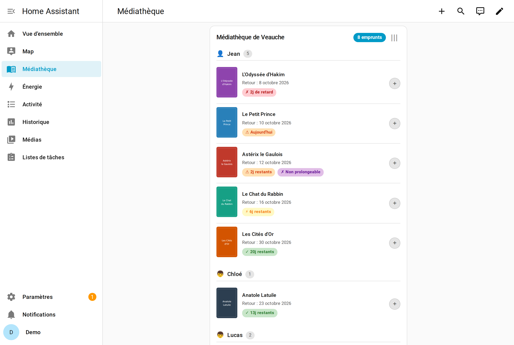

Chaque livre porte un badge de délai — « 2j de retard » en rouge,
« Aujourd'hui » en orange, « 6j restants » en jaune, « 20j restants » en vert.
Le bouton rond à droite marque le livre comme lu ; le bouton **|||** en haut
ouvre le code-barres de votre carte.

---

## Et ensuite

La carte a **trois modes**, que vous choisissez dans son éditeur.

### Couvertures

Une grille de vignettes, pour repérer les livres d'un coup d'œil.

```yaml
type: custom:mediatheque-card
entity: sensor.mediatheque_VOTRECARTE_emprunts_mediatheque
mode: covers
```

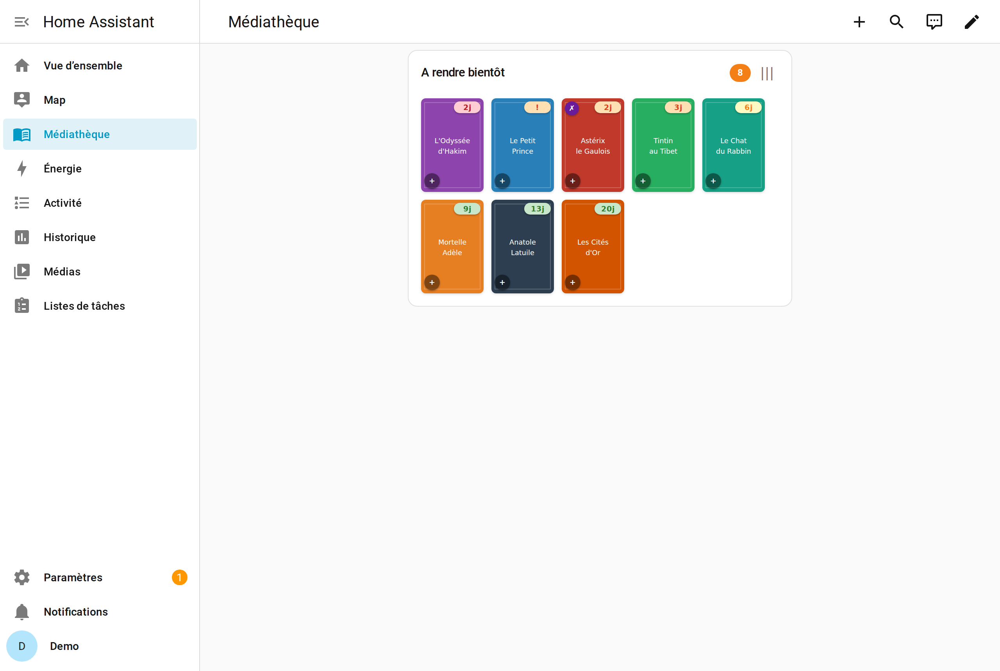

### Carousel

Une bande basse, sans en-tête, conçue pour une tablette murale : une centaine
de pixels de haut, contre plus du double pour les autres modes. La pastille
bleue compte les livres affichés.

```yaml
type: custom:mediatheque-card
entity: sensor.mediatheque_VOTRECARTE_emprunts_mediatheque
mode: carousel
```

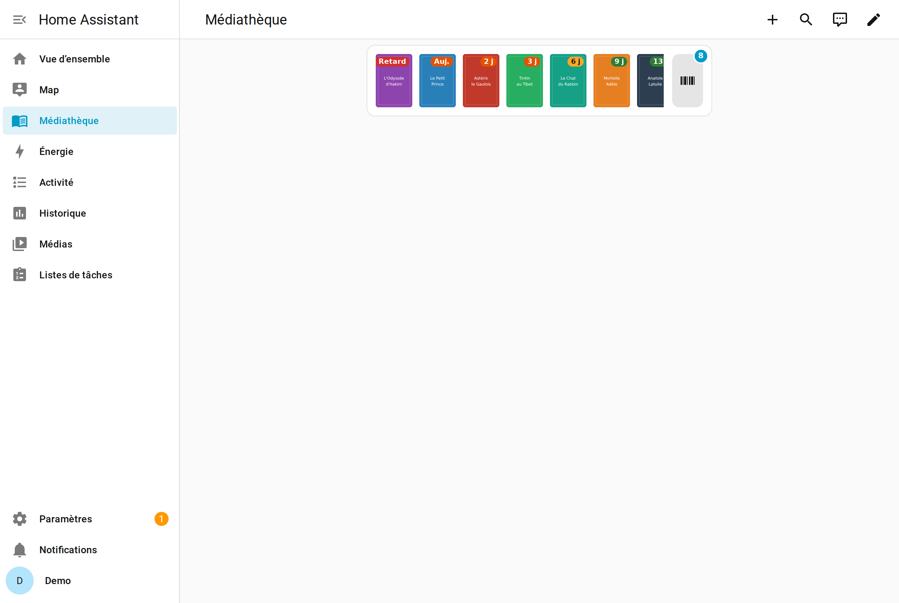

### Le code-barres

Le bouton de droite affiche le code-barres de votre carte de bibliothèque, à
présenter au scanner de la banque de prêt. Plus besoin de sortir la carte.

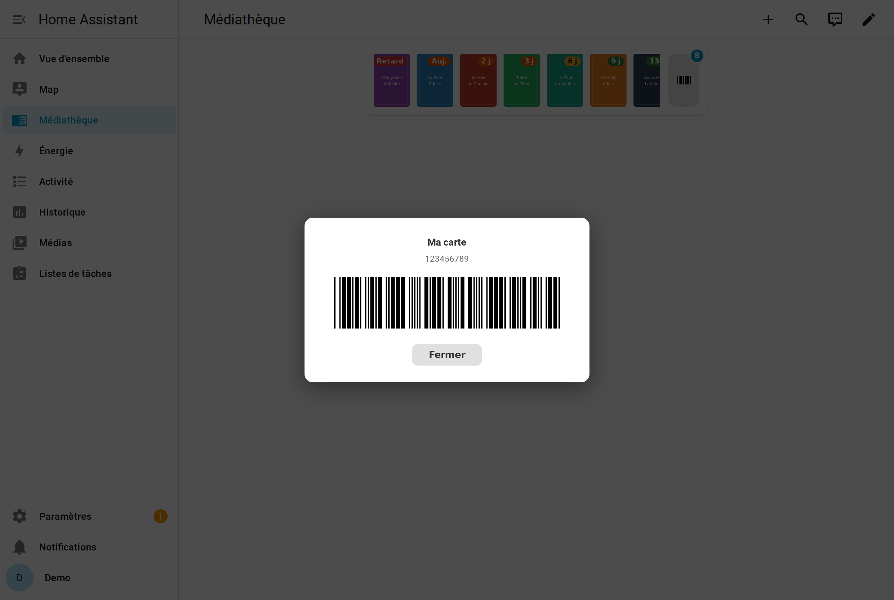

### La fiche d'un livre

Un appui sur une couverture ouvre sa fiche : titre, ISBN, et selon le cas les
boutons **Prolonger** et **Marquer comme lu**.

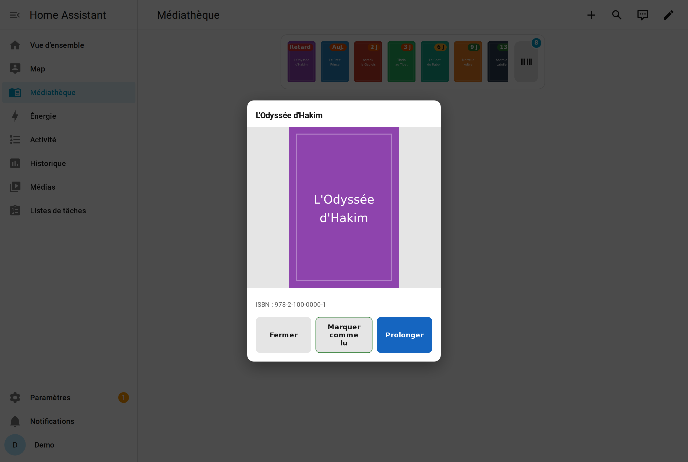

---

## Si ça ne marche pas

**« Custom element doesn't exist: mediatheque-card »**
Videz le cache du navigateur et rechargez (Ctrl+Maj+R). Si le message persiste,
vérifiez dans **Paramètres → Tableaux de bord → Ressources** que
`/mediatheque_veauche/mediatheque-card.js` est bien listé. En configuration
YAML, l'intégration ne peut pas l'ajouter elle-même : déclarez-la à la main.

**La carte reste sur « Chargement… »**
Le capteur n'a pas encore de données. Patientez le temps de la première
synchronisation, puis vérifiez l'état du capteur dans **Outils de
développement → États**.

**Une carte posée en dessous recouvre la liste**
Vous êtes en version antérieure à la 4.1.1 — mettez à jour. Si ça persiste,
c'est que la taille de la carte a été fixée à la main un jour : ouvrez le
tableau de bord en modification, cliquez la carte, et réinitialisez sa taille.

**Les délais semblent décalés d'un jour**
Vérifiez le fuseau horaire de Home Assistant dans
**Paramètres → Système → Général**.

---

## Pour aller plus loin

Le [README](../README.md) détaille toutes les options : filtrer par badge,
régler la hauteur des couvertures, masquer les badges lointains, marquer les
livres lus depuis une automatisation.
